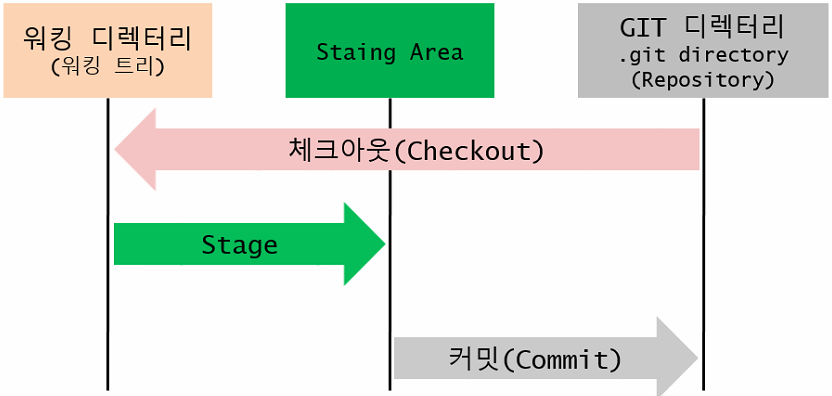
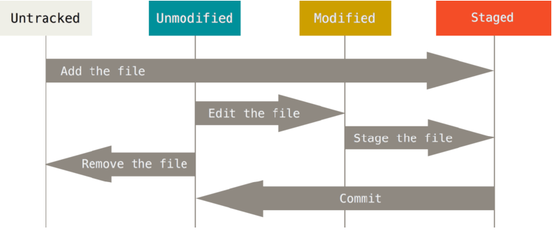

# Git & Github 실무활용
## Git
* 2005 리눅스 커널 개발자인 리누스 토발즈가 개발
* Git은 소프트웨어 개발에서 버전 관리를 위한 도구
* Git은 분산 버전 관리 시스템
* 개별 작업자가 중앙화된 코드 호스팅 시스템에서 독립적으로 일하고 프로젝트 저장소의 개별 로컬 사본에서 작업을 수행
## Git 특징
* Git의 데이터는 파일 시스템의 스냅샷
* Git은 시간순으로 파일의 스냅샷을 저장
* Git은 대부분의 명령을 로컬에서 실행
* Git은 오프 라인 상태에서도 작업을 할 수 있음
* Git은 데이터의 무결성을 위해 SHA-1 해시를 사용하여 체크섬을 만듦
* 대규모 프로젝트를 위한 완전한 분산 환경 지원
* 체크섬은 해시(SHA-A)로 40자 길이의 16진수 문자열
## Git 장점
* 분산 환경에서 저장소 관리
* 로컬 저장소에서 파일 생성 및 수정
* 로컬 저장소에서 수정 내역 추적
* 원격 저장소에 적용된 내용을 동일하게 로컬 저장소에 적용
* 원격에 영향을 끼치지 않는 브랜치 생성
* 버전 관리 용이
* 이슈 추적 용이
## 저장소(repository)
* 이력을 관리하는 저장소
* 로컬 저장소(Local Repository)
    * 개인 전용 저장소
* 원격 저장소(Remote Repopsitory)
    * 공유 저장소
## 변경 이력 관리(history)
* 커밋 단위
* 40자리 해시키로 관리
* 날짜, 시간, 커밋 메시지, 작업자
* 브랜치 형태로 관리

## 세가지 상태 - modified/staged/commited
* 두 번째로 알아야 할 개념은, modified, staged, committed 이다. 이 세가지 개념은 변경점들이 어떠한 상태에 있는가에 대한 개념이라고 생각하면 된다. 

### committed
* git에서는 변경점의 집합(실제로는 snapshot형태)을 database에 저장하는 행위를 commit이라 한다. committed는, 변경점들이 commit되어 database에 저장된 상태이다.

### modified
* 말 그대로 변경된 상태이다. git이 기억하고 있던 상태에서 무언가 변경이 일어난 파일은 modified 상태가 된다. 파일의 추가나 삭제도 기존 상태에서 변경이 일어난 것이므로 modified 상태에 포함된다.

### staged
* modified 상태의 내용들 중에 실제 commit의 대상이 될 수 있도록 선택된 상태이다. Tool에 따라서는 파일단위가 아닌 line단위로도 staged상태로 보낼 수 있다. 아무리 사용자가 소스를 수정했어도 staged 상태로 변경되지 않은 내용들은 git에 commit되지 않는다. 대부분의 경우에 번거로운 중간과정이 될 수 있어, staged를 생략하고 modified에서 바로 commit 할 수 있는 옵션도 제공된다.





# 에러발생
* git pull origin 브런치명 --allow-unrelated-histories
* --allow-unrelated-histories 
    * 이 명령 옵션은 이미 존재하는 두 프로젝트의 기록(history)을 저장하는 드문 상황에 사용된다고 한다. 즉, git에서는 서로 관련 기록이 없는 이질적인 두 프로젝트를 병합할 때 기본적으로 거부하는데, 이것을 허용해 주는 것이다.
# 도움말 보기
`git 명령어 --help`

# add
```console
git add filename1 filename2
git folder/*

git add .
git add --all

git add --update
```

# commit
```console
git commit

git commit -m "message"
```