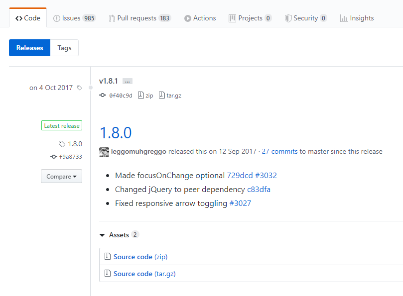
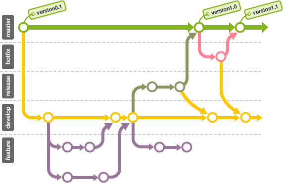
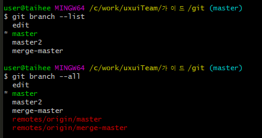

# Git & Github 실무활용
## Git
* 2005 리눅스 커널 개발자인 리누스 토발즈가 개발
* Git은 소프트웨어 개발에서 버전 관리를 위한 도구
* Git은 분산 버전 관리 시스템
* 개별 작업자가 중앙화된 코드 호스팅 시스템에서 독립적으로 일하고 프로젝트 저장소의 개별 로컬 사본에서 작업을 수행
## Git 특징
* Git의 데이터는 파일 시스템의 스냅샷
* Git은 시간순으로 파일의 스냅샷을 저장
* Git은 대부분의 명령을 로컬에서 실행
* Git은 오프 라인 상태에서도 작업을 할 수 있음
* Git은 데이터의 무결성을 위해 SHA-1 해시를 사용하여 체크섬을 만듦
* 대규모 프로젝트를 위한 완전한 분산 환경 지원
* 체크섬은 해시(SHA-A)로 40자 길이의 16진수 문자열
## Git 장점
* 분산 환경에서 저장소 관리
* 로컬 저장소에서 파일 생성 및 수정
* 로컬 저장소에서 수정 내역 추적
* 원격 저장소에 적용된 내용을 동일하게 로컬 저장소에 적용
* 원격에 영향을 끼치지 않는 브랜치 생성
* 버전 관리 용이
* 이슈 추적 용이
## 저장소(repository)
* 이력을 관리하는 저장소
* 로컬 저장소(Local Repository)
    * 개인 전용 저장소
* 원격 저장소(Remote Repopsitory)
    * 공유 저장소
## 변경 이력 관리(history)
* 커밋 단위
* 40자리 해시키로 관리
* 날짜, 시간, 커밋 메시지, 작업자
* 브랜치 형태로 관리

## 세가지 상태 - modified/stage/commited
* 두 번째로 알아야 할 개념은, modified, stage, committed 이다. 이 세가지 개념은 변경점들이 어떠한 상태에 있는가에 대한 개념이라고 생각하면 된다. 

### committed
* git에서는 변경점의 집합(실제로는 snapshot형태)을 database에 저장하는 행위를 commit이라 한다. committed는, 변경점들이 commit되어 database에 저장된 상태이다.
* 변경이 저장되는 곳, 히스토리로 남는 공간.

### modified
* 말 그대로 변경된 상태이다. git이 기억하고 있던 상태에서 무언가 변경이 일어난 파일은 modified 상태가 된다. 파일의 추가나 삭제도 기존 상태에서 변경이 일어난 것이므로 modified 상태에 포함된다.

### stage
* 변경 사항이 커밋 되기 전에 잠시 머무는 공간
* modified 상태의 내용들 중에 실제 commit의 대상이 될 수 있도록 선택된 상태이다. Tool에 따라서는 파일단위가 아닌 line단위로도 staged상태로 보낼 수 있다. 아무리 사용자가 소스를 수정했어도 staged 상태로 변경되지 않은 내용들은 git에 commit되지 않는다. 대부분의 경우에 번거로운 중간과정이 될 수 있어, staged를 생략하고 modified에서 바로 commit 할 수 있는 옵션도 제공된다.

### 버전에 대한 관점

### 파일에 대한 관점


# 에러발생
* git pull origin 브런치명 --allow-unrelated-histories
* --allow-unrelated-histories 
    * 이 명령 옵션은 이미 존재하는 두 프로젝트의 기록(history)을 저장하는 드문 상황에 사용된다고 한다. 즉, git에서는 서로 관련 기록이 없는 이질적인 두 프로젝트를 병합할 때 기본적으로 거부하는데, 이것을 허용해 주는 것이다.


# git 명령어 기반
```
git [실행명령어] [옵션] [목적지 or 행위] [대상] [추가옵션]
```

# 도움말 보기
`git 명령어 --help`

# add
```console
git add filename1 filename2
git folder/*

git add .
git add --all

git add --update
```

# commit
```console
git commit

git commit -m "message"
```
Staging Area 생략(git add)하고 commit
준비영역(stage)에 등록된 적이 있는 파일만 가능
```
git commit -a -m "message"
```

## 커밋 메시지 변경
새로운 커밋을 생성하지 않고(and) 가장 최근에 작성한 커밋 *코멘트 내용*을 수정
```
git commit --amend
git commit --amend -m "message"
```
☞ git commit과 같이 지정된 EDITOR를 실행하여 커밋 메시지 입력

## dash 하나와 두개의 차이

# log
```console
git log
git reflog

지정된 수만큼 로그를 출력
git log -3
git log -3 --oneline

한 줄로 메시지 보기
git log --oneline
git log --pretty=oneline

커밋의 diff 결과 보여 주기
git log -p
git log -p -2
히스토리 통계(수정된 파일, 얼마나 많은 파일이 변경, 얼마나 많은 라인)
git log --stat

로그 메시지와 하나의 커밋에 포함된 수정사항을 확인
git show 커밋해시
git show ba3784e
```

# tag
* 특정한 커밋을 찾아내기 위해 사용(책갈피), 버전관리
* 중복 비 허용


```console
태그 등록
git tag patch-12345

태그 정보 확인
git show pactch-12345

나중에 태그 하기
git tag <태그이름> <커밋해시>
git tag pactch-54321 abcdefg

모든 태그 목록 보기
git tag

태그가 적용된 커밋의 상세 정보 보기
git show <tag-name>
```
## tag를 다른 위치에 다시 사용해야 할때 
중복될 경우 다음과 같은 오류 문구가 나옵니다.
fatal: tag 'tip' already exists
이걸 무시하고 싶으시다면, 염력으로 이동 시키면 됩니다.
```console
git tag --force 태그
git tag -a 'abc' 45ac838 -f
```
## Annoatated Tag
tag에 대한 추가 정보 입력
```console
태그 등록
git tag -a <태그이름> -m "message"
git tag -a version-1.0 -m "version 1.0"

나중에 태그 하기
git tag -a <태그이름> <커밋해시> -m "message"
git tag -a version-0.1 a860054 -m "version 0.1"
```

## tag 공유
태그는 자동으로 리모트 서버에 전송하지 않는다.
별도로 서버에 PUSH해야 한다.
```console
태그를 원격 서버에 전송
git push origin [태그이름]
git push origin Version-1.0

모든 태그를 원격 서버에 전송
git push origin --tags
```

## tag 기반 체크 아웃
```
git checkout -b [브랜치이름] [태그이름]
git checkout -b release-1.0 version-1.0
```

# branch
* 브랜치는 저장소의 새로운 분할이다.


```
로컬 브랜치 목록 출력
git branch --list

모든 브랜치 목록
git branch --all
```


## 새로운 브랜치 생성 branch
```
git branch <branch-name>
git checkout <branch-name>
git branch release-1
git checkout release-1
```
## 새로운 브랜치 생성 하고 바로 체크 아웃 : branch 단계 생략
```
git checkout -b <branch-name>
git checkout -b hotfix-1
```

# Merge
## Diff(비교)
```
변경 내용을 병합하기 전에 비교
git diff <원본브랜치> <대상브랜치>
git diff master hotfix
git diff master origin/master
```
## Merge(병합)
```
마스터(master)에 브랜치(hotfix)를 병합
git checkout master
git merge hotfix
로컬에 원격 브랜치 병합
git diff master origin/master
git merge origin/master
```

# Conflict 충돌
```
병합 취소
git merge --abort

출동 해결
충돌하는 파일을 수정 후 add, commit
git add <conflict-filename>
git commit -m "[merge] message"
```